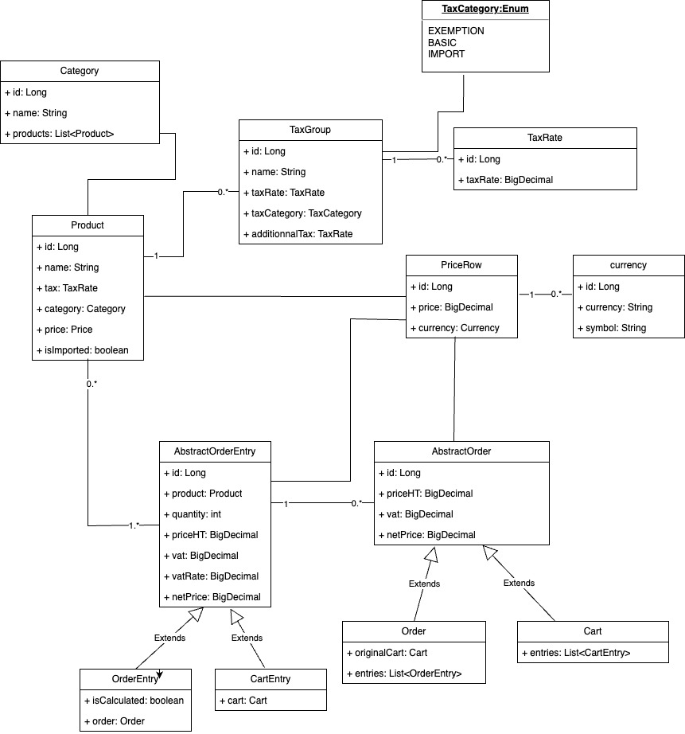

## Application Description

I have developed a lightweight e-commerce backend system that manages shopping carts within user sessions. The system supports various cart operations, including adding items to the cart and performing complex price calculations that involve different tax types and currency conversions. Additionally, it offers the capability to place orders and provides order confirmation receipts that can be utilized for order confirmation pages.

## Problem it's solving

Basic sales tax is applicable at a rate of 10% on all goods, except books, food, and medical products that are exempt. Import duty is an additional sales tax applicable on all imported goods at a rate of 5%, with no exemptions.

When I purchase items, I receive a receipt which lists the name of all the items and their price (including tax), finishing with the total cost of the items, and the total amounts of sales taxes paid. The rounding rules for sales tax are that for a tax rate of n%, a shelf price of p contains (np/100 rounded up to the nearest 0.05) amount of sales tax.


## Design : class diagram

<div align="center">
  
</div>

## How to run

Only localhost profile is configured , i'm using a H2 database with a sample of data imported on startup

```
mvn spring-boot:run  -Dspring-boot.run.profiles=localhost
```

Then you can import this [Postman project](docs/e-commerce-example.postman_collection.json) 

Enjoy 

## Documentation

Swagger documentation is generated automatically when server is running you can access to /swagger-ui/index.html

Project Classes are also well documented, you can generate javadocs  
```
mvn javadoc:javadoc
```

## Input Examples
These scenario is tested in project test file [CartCalculationStrategyTest](src/test/java/com/shop/strategy/CartCalculationStrategyTest.java)

### Input 1
- 1 book at 12.49
- 1 music CD at 14.99
- 1 chocolate bar at 0.85

### Input 2
- 1 imported box of chocolates at 10.00
- 1 imported bottle of perfume at 47.50

### Input 3
- 1 imported bottle of perfume at 27.99
- 1 bottle of perfume at 18.99
- 1 packet of headache pills at 9.75
- 1 box of imported chocolates at 11.25

## Output Examples

### Output 1
- 1 book: 12.49
- 1 music CD: 14.99
- 1 chocolate bar: 0.85
- Sales Taxes: 1.50
- Total: 29.83

### Output 2
- 1 imported box of chocolates: 10.50
- 1 imported bottle of perfume: 54.65
- Sales Taxes: 7.65
- Total: 65.15

### Output 3
- 1 imported bottle of perfume: 32.19
- 1 bottle of perfume: 20.89
- 1 packet of headache pills: 9.75
- 1 box of imported chocolates: 11.85
- Sales Taxes: 6.70
- Total: 74.68

